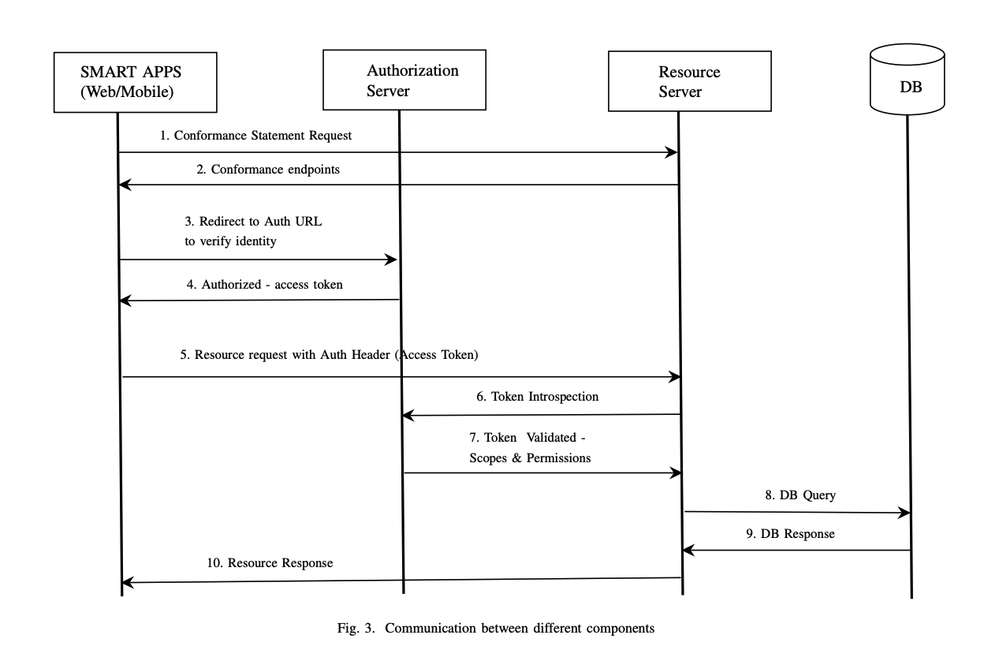

# Supplement resources for AMIA paper.

```
An HL7 FHIR and GraphQL approach for interoperability between heterogeneous Electronic Health Record systems
```

# Abstract

```
Heterogeneities in data representation and care processes create complexity in interoperability among Electronic Health Record systems (EHRs). We can resolve such data and process level heterogeneities by following consistent healthcare standards like Clinical Document Architecture (CDA), openMRS, and HL7 FHIR. However, these standards also differ at the structural and implementation level, making the interoperability complex. Hence, there is a need to resolve data level heterogeneity to achieve semantic data interoperability between heterogeneous systems. As a solution to this, in earlier works, we have proposed a system architecture that enables a high level of accuracy mapping between heterogeneous healthcare standard models. Our solution utilizes a resource server based on GraphQL and HL7 FHIR. In this work, we show how the architecture is implemented to achieve interoperability between two running EHRs that is based on HL7 FHIR and OpenMRS. The presented approach establishes secure communication between the EHRs and provides accurate mappings that enable timely health information exchange between EHRs.
```

# Code

1.  [HL7 FHIR, Resource server code](https://github.com/sureshHARDIYA/intromat-fhir)
2.  [Authorization server code](https://github.com/sureshHARDIYA/graphql-auth-server)
3.  [FHIR patient app](https://github.com/muzima/muzima-fhir)
4.  [mUzima for health provider](https://github.com/muzima/muzima-android)

# Communication between `FHIR patient app`, `HL7 FHIR Resource` server


