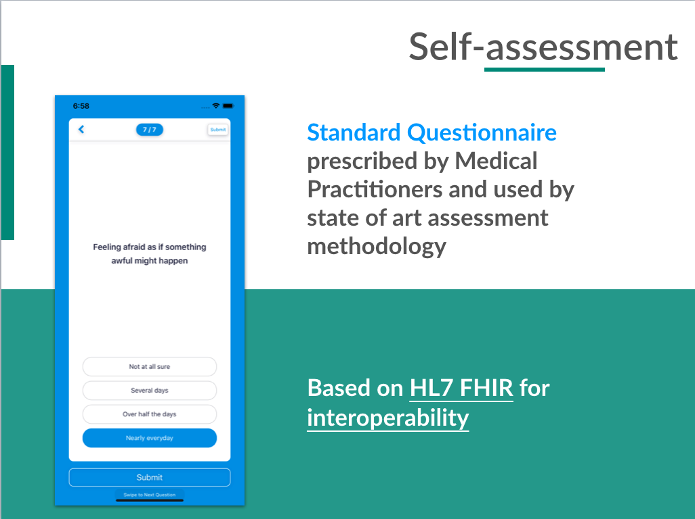
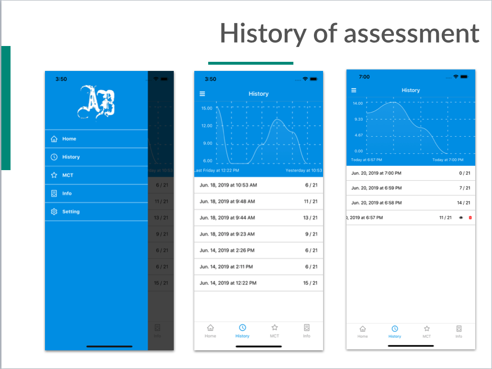

# `Resource Server` 

This is a FHIR compliant web server that is able to respond to HTTP requests using Access Tokens issued by the `Authorization Server`. The resource server developed for this prototype is built using `GraphQL`. This paper presents the need for `GraphQL` based APIs for Health Information Exchange.

# Mobile Client 

`The end Users:` These are the end users who actually log into the application to perform some function. `The SMART on FHIR Application` (referred to as the “SMART App” or “Client”) is an application that the user wishes to access to perform some function. In this paper we present `Self-assessment mobile application` for mental health morbidities assessment.

## Self-assessment mobile application

This app is designed for mental-health patients as a self-assessment tool. Based on Workflow-model presented in [1](#1) (figure 1), `assessment` is the first step in mental health intervention. The assessment is done by asking a set of standard questions prepared by domain expert. Different types of mental-health diseases have different self-assessment questionnaire. Here is a list of mental-health morbidities and associated self-assessment questionnaire used in mental health domain:

| Mental Health    | Questionnaire                                          |
| ---------------- | ------------------------------------------------------ |
| Depression       | MDI, MADRAS-S, BDI, PHQ-9, EPDS, GDS, KADS-11, SDS     |
| Anxiety          | GAD-7, SAS, HAM-A, LSAS, PAS, HAI-18, SPIN, SCAS, TMAS |
| Bipolar Disorder | ASRM, YMRS                                             |
| Eating Disorder  | BES, EAT-26                                            |
| OCD              | OCI-R                                                  |
| ADHD             | ASRSv1.1, VADRS                                        |
| Addiction        | BSAS, CAGE, NODS-CLIP, EGST, IAA, SAST                 |
| Autism Spectrum  | AQ, ASSQ, CAST, ITC, Q-CHAT, RAADS-14                  |
| Personality      | FFM, EQ, PCL-22, PTI, TEQ                              |

### Index

#### Addiction

- Bergen Shopping Addiction Scale (BSAS)
- CAGE Alcohol Questionnaire (CAGE)
- Diagnostic Screen for Gambling Disorders (NODS-CLIP)
- Excessive Gaming Screening Tool (EGST)
- Internet Addiction Assessment (IAA)
- Sexual Addiction Screening Test (SAST)

#### ADHD

- Adult ADHD Self-Report Scale (ASRSv1.1)
- Vanderbilt ADHD Diagnostic Rating Scale (VADRS)

#### Aggression

- Buss Perry Aggression Questionnaire (BPAQ)

#### Anxiety

- Generalized Anxiety Disorder 7 Item Scale (GAD-7)
- Hamilton Anxiety Rating Scale (HAM-A)
- Liebowitz Social Anxiety Scale (LSAS)
- Panic and Agoraphobia Scale (PAS)
- Short Health Anxiety Inventory (HAI-18)
- Social Phobia Inventory (SPIN)
- Spence Children’s Anxiety Scale (SCAS)
- Taylor Manifest Anxiety Scale (TMAS)
- Zung Self-Rating Anxiety Scale (SAS)

#### Autism Spectrum

- Autism Spectrum Quotient (AQ)
- Autism Spectrum Screening Questionnaire (ASSQ)
- Childhood Autism Spectrum Test (CAST)
- Infant-Toddler Checklist (ITC)
- Quantitative Checklist for Autism in Toddlers (Q-CHAT)
- Ritvo Autism & Asperger Diagnostic Scale (RAADS-14)

#### Bipolar Disorder

- Altman Self-Rating Mania Scale (ASRM)
- Young Mania Rating Scale (YMRS)

#### Depression

- Edinburgh Postnatal Depression Scale (EPDS)
- Geriatric Depression Scale (GDS)
- Kutcher Adolescent Depression Scale - 11-Item (KADS-11)
- Major Depression Inventory (MDI)
- Montgomery-Asberg Depression Rating Scale (MADRS)
- Patient Health Questionnaire (PHQ-9)
- Zung Self-Rating Depression Scale (SDS)

#### Eating Disorder

- Binge Eating Scale (BES)
- Eating Attitudes Test - 26 Item (EAT-26)

#### OCD

- Obsessive Compulsive Inventory - Revised (OCI-R)

#### Personality

- Big 5 Personality Test (FFM)
- Empathy Quotient (EQ)
- Hare Psychopathy Checklist (Original) (PCL-22)
- Personality Type Indicator (PTI)
- Toronto Empathy Questionnaire (TEQ)

### Views

#### Self-assessment screen

#### Self-assessment single question Detailed view

#### Self-assessment single History view

# Web Client 

# Authorization Server 

The authorisation server is an OpenID connect compliant web server with an ability to authenticate users and grant authorisation access tokens. More- over, authorisation server manages scopes and permission of the clients, introspects token and requests for the resource server.

# References

1. Suresh Kumar Mukhiya, Fazle Rabbi, Violet Ka I Pun, Yngve Lamo, An architectural design for creating self-reporting e-health systems. InICSE 2019Proceedings in the IEEE Digital Library(2018).
